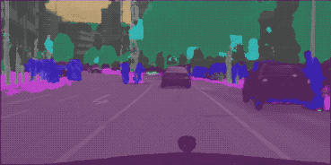

# Playground/image-segmentation

This `TensorFlow` implementation of ENet is forked from @fregu856. You can find his 
original code here: [@fregu856/segmentation.git](https://github.com/fregu856/segmentation), which is implemented based on 
the pyTorch version at https://github.com/e-lab/ENet-training

## Show me the money!

Here is a gif of the trained network: click on [the gif](https://www.youtube.com/watch?v=4OB9a3KgCXM) :point_left: to go to the youtube video.

## TODOs

- parallelize training to use more GPUs

### ENet Paper: 

The original paper for this model could be found here: 
[2016 Adam Paszke, et.al., ENet: A Deep Neural Network Architecture for Real-Time Semantic Segmentation
](https://arxiv.org/pdf/1606.02147.pdf)

## Common Problems

If you encounter the "No gradient defined for operation 'MaxPoolWithArgmax_1' (op type: MaxPoolWithArgmax)", you just need to use a GPU tensorflow instance, b/c the max_pool_with_argmax operator is not defined for the CPU.
                                             k
